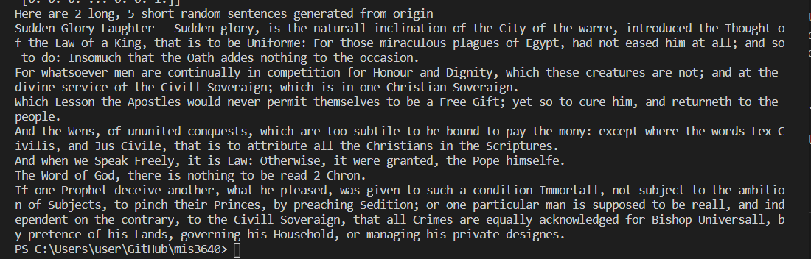

## This is Part 3: Project Writeup and Reflection

**1. Project Overview** 

    The data source used in this project is from Project Gutenberg (http://www.gutenberg.org/) which is a website that freely provides more than 55,000 e-books. All the books are legal and in text format which makes them easier for us to process in programming languages. This project uses python in particular to analyze the large amount of information in bood Leviathan, for instance, summary statistics and sentiment analysis. Techniques involved include installing and importing libraries and writing and calling functions to accomplish these results.

**2. Implementation** 

    This project contains several major components. The ultimate goal is to achieve what is required for the purpose which is text analysis, in order to do so, text itself and a thorough planning must be performed ahead of time. In this system architecture, large question is broke into a sequence of specific functions to solve a problem. This is like baking or writting a business plan. The whole process needs a draft of clarified steps from the beginning to the end. Order matters, we cannot generate any sentences without loading the file.

    This program includes text loading, chracterizing word by its frequency, computing summary statistics, sentiment analysis, text similarities, and text clustering. For the last three parts some existing toolboxes (NTLK by Steven Bird, Edward Loper, and Ewan Kleinand, and sklearn by David Cournapeau) are being used.

    Each section is a preperation for the next, they should be logically connected, as supports for more effective operations. An alternative I chose is in line 123, to choose a random word from the histogram and the probability is propotional to its frequency. Old algorithm put words*freq into a list while the new method takes advantage of accumulation of word frequencies. This saves spaces and optimizes operation speed by transforming word frequency into intervals. In Leviathan there are quite a few words have frequency that is over 1000, in this case the result yielded is obvious.

**3. Results** 

    I have used Markov's algorith to complete a task that allow this program to build a generative model from Leviathan and to generate new sentence. 

    An interesting observation from this experienment is that if the upper word limit for short sentence is too low, like 15 or 10 or lower, the result will generate "None". Languages have their own syntax as well as structures, and if certain components are missing this algorith will not be able to successfully generate a complete sentence as expected.
    I have also done a sentiment analysis, the result is as shown below:

    "{'neg': 0.001, 'neu': 0.999, 'pos': 0.0, 'compound': -0.8481}"

    This data means Leviathan has few negative words, mostly neutral and nearly no positive word. Counpound is final integrated score of word usage in the book. It brings a thought that this displayed statistic can be helpful in institutions as well as a helper for academic purposes. 

**4. Reflection** [~1 paragraph]
From a process point of view, what went well? What could you improve? Other possible reflection topics: Was your project appropriately scoped? Did you have a good plan for unit testing? How will you use what you learned going forward? What do you wish you knew before you started that would have helped you succeed?

    This project leaves huge space for improving problem solving skills as well as team spirit. Regarless of the fact I finished the project without pairing with classmates, I have reached out to nearby sources to ask for help when there is uncertainties. A problem in this process is generating text clusterings. Resulting figure generates large number of dots and the wrongful presented image indicates an unfound error in the algorithm. Besides the mentioned problem, other minor difficulties are sorted out by running the program in units. Having a chance of experiencing to solve a problem from scratch truly builds up a sense of how the process is like and what it takes to get to certain accomplishment. Subjects and everthing are more and more interconnected these days, at certain level what is required to be successful not only in programming but other tasks are extremely alike. I wish I'd knew some more sincere coding experiences are like and how others have went through this same process from unknown to familiar.
